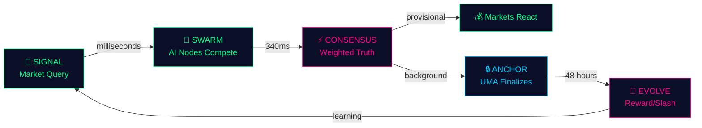
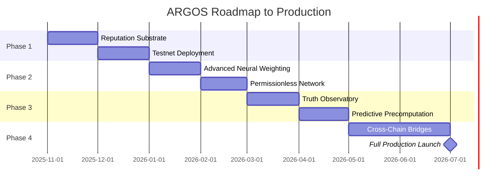

# ⚡️ ARGOS (Adaptive Reputation-Gated Oracle System)

<div align="center">


[](https://opensource.org/licenses/MIT)
[](https://github.com/your-repo/argos)
[](https://discord.gg/YOUR_INVITE)
[](https://github.com/your-repo/argos)

**A self-evolving, swarm-intelligence oracle network. Born from the intersection of cryptoeconomics and emergent AI, it creates a living nervous system for blockchain truth—where competing synthetic minds battle for dominance, and only the most accurate survive.**

[🚀 Quick Start](#-quick-start) • [📖 Documentation](#-documentation) • [🎯 Architecture](#-neural-architecture-the-four-layers) • [🤝 Contribute](#-join-the-evolution)

</div>

---

## 🌌 The Oracle Singularity Problem


In the architecture of decentralized finance, oracles are the sensory organs—the bridge between blockchain determinism and the chaos of reality. But they're fundamentally broken.

  * **Secure Oracles (UMA's Optimistic Oracle)** achieve consensus through economic finality. They represent *absolute truth*—but truth delayed is truth denied. 24-48 hour resolution times make them unusable for high-frequency markets, derivatives, and the next generation of on-chain applications.
  
  * **Fast Oracles** sacrifice security for speed. Centralized APIs and naive AI agents provide instant answers but are fragile, opaque, and easily corrupted. They're single points of failure in a trustless world.

The deeper problem? **Oracles don't evolve.** Each query is answered in isolation. There's no memory, no learning, no adaptation. We're building the future of finance on systems that can't get smarter.

<br clear="right"/>

## 💡 The Solution: Darwinian Truth Discovery

<div align="center">


</div>

**ARGOS** doesn't just fetch data—it *cultivates intelligence*.

Imagine a gladiatorial arena where specialized AI agents—**Instant Oracle Nodes (IONs)**—stake their existence on the accuracy of their predictions. Each node is a synthetic mind with its own strategy, data sources, and reasoning models. They compete in real-time, submitting confidence-weighted predictions backed by cryptographic proof.

The twist? **Evolution happens on-chain.**

UMA's Optimistic Oracle becomes the ultimate judge—the immutable arbiter of truth. When it finalizes a result 48 hours later, ARGOS uses that ground truth to reward the victors and *eliminate* the weak. Accurate nodes earn reputation and influence. Failed nodes are slashed, their stake seized, their voices diminished.

> Over time, the network doesn't just provide answers—it *becomes* the answer. A self-optimizing, domain-specialized superintelligence that gets faster, sharper, and more reliable with every prediction.

---

## 🔮 Core Innovations

<table>
<tr>
<td width="50%">

### 🧬 Evolutionary Swarm Intelligence

ARGOS is a Darwinian battlefield. Hundreds of competing strategies—API aggregators, web scrapers, LLMs, sentiment analyzers, custom ML models—fight for survival.


**The best architectures propagate. The failures fade into entropy.**

</td>
<td width="50%">

### 🎯 Hyperdimensional Reputation Matrix

Reputation isn't a number—it's a multi-dimensional score mapped across domains, timeframes, and confidence bands.


**The system learns *who* to trust for *what*.**

</td>
</tr>
<tr>
<td width="50%">

### ⚡️ Instant Provisional Reality

While UMA processes truth through economic consensus, ARGOS provides 99% confidence in milliseconds.


**Quantum oracle superposition—provisional and final states simultaneously.**

</td>
<td width="50%">

### 🔗 UMA-Anchored Security

ARGOS accelerates cryptoeconomic security. UMA = bedrock truth. ARGOS = neural prediction layer.


**Speed for users. Security for protocols.**

</td>
</tr>
</table>

---

## ⚙️ The Evolutionary Loop: From Query to Singularity

<div align="center">



</div>

### Phase 1: **SIGNAL** → A market emits a query

A prediction market, derivative protocol, or dApp broadcasts a truth request to the ARGOS network.

```bash
QUERY: "Will the James Webb Telescope detect 
        biosignatures on K2-18b by 2026?"
```

<br clear="right"/>

### Phase 2: **SWARM** → Synthetic minds converge

Every active ION receives the signal. Within milliseconds, a distributed swarm of AI agents begins parallel analysis:

  * **Node Alpha** (astronomy API aggregator) scrapes NASA databases
  * **Node Beta** (LLM reasoning engine) analyzes scientific papers
  * **Node Gamma** (prediction market arbitrageur) checks Polymarket odds
  * **Node Delta** (social sentiment analyzer) scans researcher Twitter feeds

Each node stakes collateral and submits its belief:

```json
{
  "node_id": "ION-Alpha-7C3F",
  "outcome": "NO",
  "confidence": 0.87,
  "stake": "500 UMA",
  "proof_hash": "0x3a7f9e2b8c1d...",
  "reasoning_trace": "ipfs://Qm..."
}
```

<br clear="left"/>

### Phase 3: **CONSENSUS** → The hive mind speaks

<div align="center">

</div>

The **ARGOS Aggregator Core**—a smart contract neural network—ingests all submissions. Using Bayesian trust-weighting and domain-specific reputation scores, it synthesizes a single provisional truth:

```python
Weight(node) = Confidence × Reputation × Stake × Domain_Specialization
```

The aggregate answer emerges:

```bash
PROVISIONAL RESULT: NO (Confidence: 0.84)
Time to consensus: 340ms
Network agreement: 87%
Dissenting nodes: 2 (low influence)
```

<div align="center">

**✨ This result is immediately available. Markets settle provisionally. Life continues. ✨**

</div>

### Phase 4: **ANCHOR** → Truth crystallizes

In the background, UMA's Optimistic Oracle begins its cryptoeconomic finalization ritual. Proposers stake bonds. Disputers challenge. 48 hours pass. Economic consensus forms.

```bash
UMA FINAL RESULT: NO ✅
Finalization time: 47h 23m
Economic consensus achieved
Bonds settled: $2.4M
```

<br clear="right"/>

### Phase 5: **EVOLVE** → Natural selection executes

<div align="center">

</div>

The **Finalization Bridge** triggers the reckoning:

<table>
<tr>
<td align="center" width="50%">

### ✅ THE VICTORS

**Alpha, Beta, Delta**

🏆 Earn protocol fees<br/>
📈 Reputation boost<br/>
⚡ Increased domain influence<br/>
💎 Stake returned with rewards

</td>
<td align="center" width="50%">

### ❌ THE FALLEN

**Gamma**

💸 Stake slashed<br/>
📉 Reputation destroyed<br/>
👻 Domain weights recalibrated<br/>
🔇 Future influence diminished

</td>
</tr>
</table>

**The network has learned. Next time, Gamma's voice is quieter. The system has adapted.**

---

## 🏗️ Neural Architecture: The Four Layers

<div align="center">


</div>

### 🌐 Layer 1: **The Sensory Network** (ION Substrate)

Anyone can deploy an **Instant Oracle Node**—a lightweight synthetic agent that connects to reality. Nodes are strategy-agnostic:

  * 🔌 API aggregators pulling from centralized oracles
  * 🕷️ Web scrapers reading real-world data
  * 🧠 LLMs reasoning over natural language
  * 📊 Custom ML models trained on historical patterns
  * 🔮 Hybrid architectures combining multiple approaches

**The only requirement? Stake skin in the game.**

<br clear="right"/>

### 🧠 Layer 2: **The Consciousness Core** (Aggregator Engine)

A smart contract that functions as a distributed neural network. It doesn't just average responses—it *learns trust*. Using:

```yaml
🎲 Bayesian belief propagation:    Confidence aggregation
🎯 Domain-specific weighting:      Specialization matrices  
⏰ Temporal decay functions:       Recency bias
🛡️ Adversarial filtering:          Manipulation detection
```

**The output is a singular, high-confidence prediction with cryptographic provenance.**

### 🔗 Layer 3: **The Truth Bridge** (UMA Integration)

A bidirectional relay between provisional reality (ARGOS) and absolute reality (UMA). It:

  * 👁️ Monitors UMA finalization events
  * ⚡ Triggers reward/slashing transactions atomically
  * 📝 Maintains cryptographic audit trails
  * 🌉 Enables instant provisional settlement with eventual UMA finality

<br clear="left"/>

### 📈 Layer 4: **The Evolution Engine** (Reputation Substrate)

The long-term memory of the network. An on-chain learning system that:

<div align="center">

| Function | Description |
|----------|-------------|
| 📊 **Multi-Dimensional Tracking** | Accuracy vectors for each node |
| 🔍 **Domain Discovery** | Auto-clustering of specializations |
| ⚖️ **Dynamic Weighting** | Historical performance adjustment |
| ✂️ **Economic Pruning** | Underperformers eliminated |

</div>

> Over 1,000 predictions, this becomes a **knowledge graph of trust**—a living map of who knows what.

---

## 🎭 Scenario: The Prophecy of Price

<div align="center">


### **QUERY:** "Will Solana breach $250 before November 10, 2025, 23:59 UTC?"

</div>

#### **T+0ms: SWARM ACTIVATES**

```bash
ION-Perseus [CoinGecko API]      → YES (0.96 confidence, Rep: 85/100) ⭐
ION-Athena [DEX aggregator]      → YES (0.91 confidence, Rep: 92/100) ⭐⭐
ION-Oracle [GPT-4 reasoner]      → YES (0.88 confidence, Rep: 70/100) ⭐
ION-Cassandra [Sentiment model]  → NO  (0.55 confidence, Rep: 30/100) ⚠️
```

#### **T+340ms: CONSENSUS EMERGES**

<div align="center">

```
╔═══════════════════════════════════════════════════╗
║      ARGOS PROVISIONAL TRUTH: YES ✅              ║
║                                                   ║
║  Aggregate Confidence: 0.93                       ║
║  Network Conviction: 87%                          ║
║  Dissent: 1 node (low reputation weight)          ║
║                                                   ║
║  ⚡ Markets react instantly                       ║
║  💰 Derivatives settle                            ║
║  📈 Capital flows                                 ║
╚═══════════════════════════════════════════════════╝
```

</div>

#### **T+48h: UMA SPEAKS**

```bash
╔═══════════════════════════════════════════════════╗
║         UMA FINAL VERDICT: YES ✅                 ║
║                                                   ║
║  Economic Consensus: Achieved                     ║
║  Bonds Settled: $2.4M                             ║
║  Dispute Period: Completed                        ║
╚═══════════════════════════════════════════════════╝
```

#### **T+48h 1m: EVOLUTION**

<table>
<tr><th>Node</th><th>Action</th><th>Reputation Change</th><th>Domain Impact</th></tr>
<tr>
  <td>✅ ION-Perseus</td>
  <td>REWARD</td>
  <td>85 → 97 (+12)</td>
  <td>🎯 crypto-price specialization ⬆️</td>
</tr>
<tr>
  <td>✅ ION-Athena</td>
  <td>REWARD</td>
  <td>92 → 100 (+8)</td>
  <td>🎯 DeFi master status achieved</td>
</tr>
<tr>
  <td>✅ ION-Oracle</td>
  <td>REWARD</td>
  <td>70 → 75 (+5)</td>
  <td>🎯 crypto-price improving</td>
</tr>
<tr>
  <td>❌ ION-Cassandra</td>
  <td>SLASH</td>
  <td>30 → 15 (-15)</td>
  <td>⚠️ 100 UMA slashed, influence -60%</td>
</tr>
</table>

<div align="center">

**Cassandra's voice grows faint. The network has learned. Next crypto query, her words carry less weight.**

**✨ This is evolution at the speed of smart contracts. ✨**


</div>

---

## 🗺️ Prototype Status: Genesis Phase

<div align="center">

**ARGOS exists today as a proof-of-concept consciousness—a working demonstration of evolutionary oracle mechanics.**

</div>

### Current Capabilities

<table>
<tr>
<td width="50%">

#### 🟢 Operational Systems

- ✅ **Sample ION Implementations**
  - Python agents for sports, crypto, news
  - Multi-strategy demonstration
  
- ✅ **Aggregator Prototype**
  - Solidity weighted consensus
  - Bayesian trust algorithms
  
- ✅ **UMA Test Harness**
  - Finalization simulation
  - Reward/slash mechanics

</td>
<td width="50%">

#### 🟡 In Development

- ✅ **Visualization Interface**
  - React real-time dashboard
  - Node belief visualization
  - Consensus formation tracking

- 🔄 **Reputation Engine**
  - Domain specialization
  - Historical tracking

</td>
</tr>
</table>

### The Path to Singularity

<div align="center">



</div>

To transform this prototype into production-grade infrastructure:

| Milestone | Description | Impact |
|-----------|-------------|--------|
| 🔐 **On-Chain Reputation Substrate** | Gas-optimized, persistent reputation with domain specialization | Foundation for learning |
| 🌐 **Testnet Deployment** | Live UMA integration for real-world validation | Proof of concept |
| 🧠 **Advanced Neural Weighting** | Recursive Bayesian networks, adversarial robustness | Enhanced accuracy |
| 🚀 **Permissionless Node Network** | Open ION deployment with automated stake management | True decentralization |
| 📊 **Truth Observatory** | Public dashboard with real-time state and leaderboards | Transparency |
| 🔮 **Predictive Precomputation** | Pre-running likely queries for sub-100ms resolution | Instant truth |
| 🌌 **Cross-Chain Bridges** | Expansion to Solana, Cosmos, and other ecosystems | Universal adoption |

---

## 🧰 Technology Matrix

<div align="center">

| Layer | Technologies | Purpose |
|-------|-------------|---------|
| **🔗 Substrate** | Solidity, Hardhat, Foundry | Smart contract infrastructure |
| **🧠 Neural Layer** | Python, LangChain, CrewAI, Scrapy, Ethers.py | AI agent framework |
| **🎨 Interface** | React, Vite, wagmi, Ethers.js, Three.js | User experience |
| **⚓ Truth Anchor** | UMA Optimistic Oracle v3 | Cryptoeconomic finality |
| **🤖 Intelligence** | OpenAI API, Anthropic Claude, Local LLMs | Reasoning engines |

</div>

---

## 🚀 Quick Start

```bash
# Clone the repository
git clone https://github.com/your-repo/argos.git
cd argos

# Install dependencies
npm install
pip install -r requirements.txt

# Start local node
npx hardhat node

# Deploy contracts
npx hardhat run scripts/deploy.js --network localhost

# Launch sample IONs
python agents/sports_oracle.py &
python agents/crypto_oracle.py &
python agents/news_oracle.py &

# Start dashboard
cd frontend && npm run dev
```

Visit `http://localhost:5173` to witness the swarm in action.

<br clear="right"/>

---

## 📖 Documentation

<table>
<tr>
<td align="center" width="25%">

### 📘 [Architecture Docs](docs/architecture.md)

Deep dive into the neural layers

</td>
<td align="center" width="25%">

### 🎯 [ION Developer Guide](docs/ion-guide.md)

Build your own oracle node

</td>
<td align="center" width="25%">

### 🔐 [Security Model](docs/security.md)

Cryptoeconomic guarantees

</td>
<td align="center" width="25%">

### 📊 [API Reference](docs/api.md)

Integration endpoints

</td>
</tr>
</table>

---

## 🤝 Join the Evolution

<div align="center">

**ARGOS is more than a protocol—it's an experiment in emergent intelligence.**

We're building a system where truth isn't declared by authority, but *discovered through competition*.

</div>

### We're Seeking

<table>
<tr>
<td width="50%">

#### 🧠 Builders

- **AI Architects** to design novel node strategies
- **Solidity Engineers** to optimize on-chain computation
- **Data Scientists** to analyze learning patterns
- **Frontend Developers** to craft the truth interface

</td>
<td width="50%">

#### 🔬 Researchers

- **Cryptoeconomic Researchers** to harden game theory
- **Security Auditors** to hunt vulnerabilities
- **ML Engineers** to enhance consensus algorithms
- **UX Designers** to visualize the swarm

</td>
</tr>
</table>

### Getting Involved

<div align="center">

[](https://github.com/your-repo/argos/issues)
[](https://github.com/your-repo/argos/discussions)
[](https://discord.gg/YOUR_INVITE)

</div>

> If you believe oracles should *evolve*, not just *report*—if you want to build infrastructure for a world where synthetic intelligence and cryptographic truth converge—**the swarm is waiting**.

See [CONTRIBUTING.md](CONTRIBUTING.md) for transmission protocols.

---

## 🌟 Star History

<div align="center">

[](https://star-history.com/#your-repo/argos&Date)

</div>

---

## 📜 Protocol License

<div align="center">

**MIT License**

Truth should be free.

See [LICENSE](LICENSE) file for details.


</div>

---

<div align="center">


### *"In the beginning, there was data. Then there was truth. Now there is ARGOS—where data evolves into truth, and truth evolves into intelligence."*

[](https://twitter.com/argos_oracle)
[](https://github.com/argos-labs)

**⚡ Built with UMA • Powered by Evolution • Secured by Cryptoeconomics ⚡**

</div>